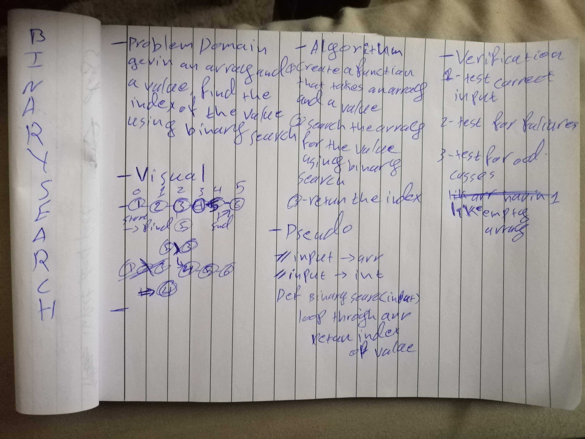

# Challenge Summary
Find the index of a given element if its in the array
## Challenge Description
Your given an ordered array and asked to bring out the index of that element

## Approach & Efficiency
used recursion for cleaner and nicer ( and because i want to train more on recursion)
## Solution

