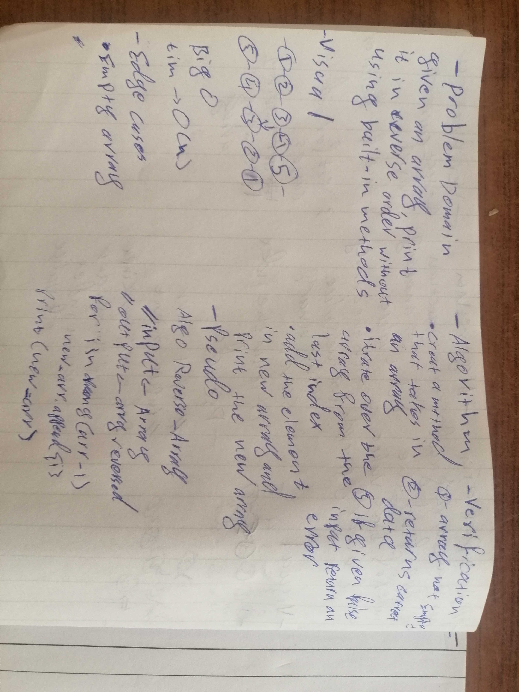

# Reverse an Array
There are many built in ways reverse an array such as the array.reverse


## Challenge
U will be given an array and u have to print it in reverse
## Approach & Efficiency
i used slicing to do this challenge
```
a=[some values]
 #a[start:stop:step]
a=a[::-1]
```
this simply gose through the array from end to start one by one
am not sure what big o notation is this
i feel like its O(1) since its only one line  but if the size of the array effects the time it should be O(n)
## Solution

