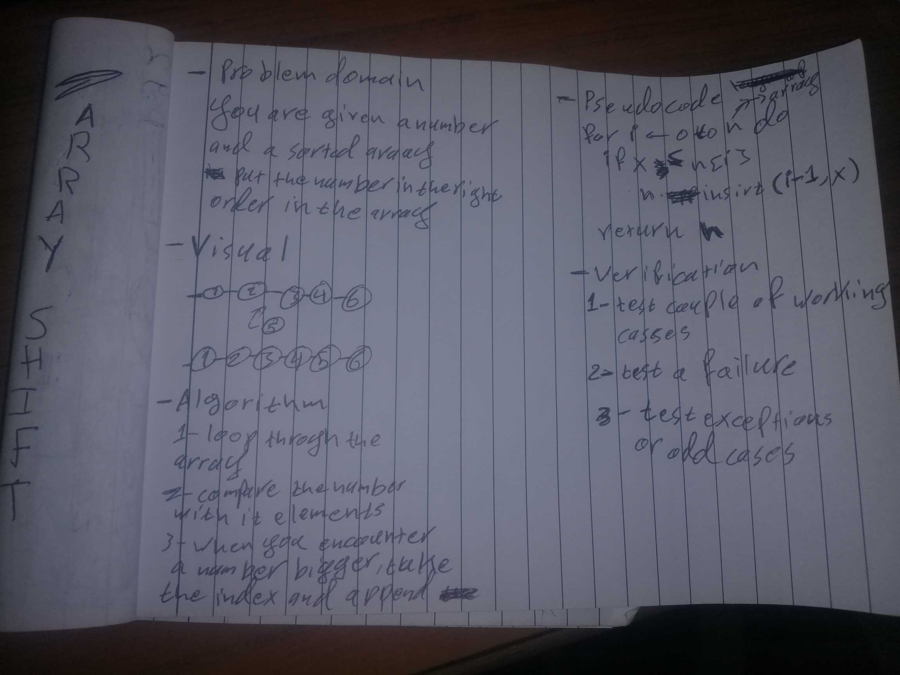

# Challenge Summary
Insert and shift an array in middle at index
## Challenge Description
Your given an ordered array and asked to input a number in a correct order

## Approach & Efficiency
Since the array is already ordered i had only serach for an element inside the array that is bigger
than the number i want to insert inside it.
as soon as i looped through the array and foudn that element i take its index
use slicing to cut the array in half and  list concatenation at add the number in the right place
## Solution

