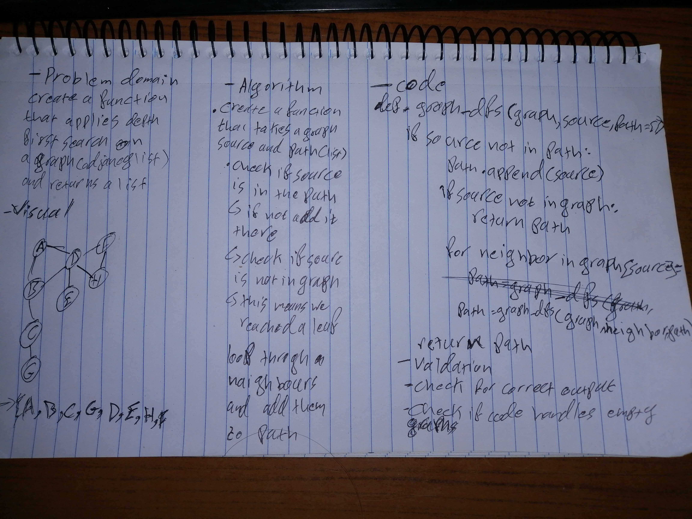

# Graphs
A graph is a common data structure that consists of a finite set of nodes (or vertices) and a set of edges connecting them. A pair (x,y) is referred to as an edge, which communicates that the x vertex connects to the y vertex. In the examples below, circles represent vertices, while lines represent edges.

## Challenge
implement depth first search on graph(adjacency list)
## Approach & Efficiency
used recursion for training proposes
BigO:

Space : O(n) # am creating a new list that will contain the nodes of the graph

Time : O(n) # because am going through the whole graph regardless of its length

#### i would appreciate it if would correct me if am wrong about the space and time complexity

## API

