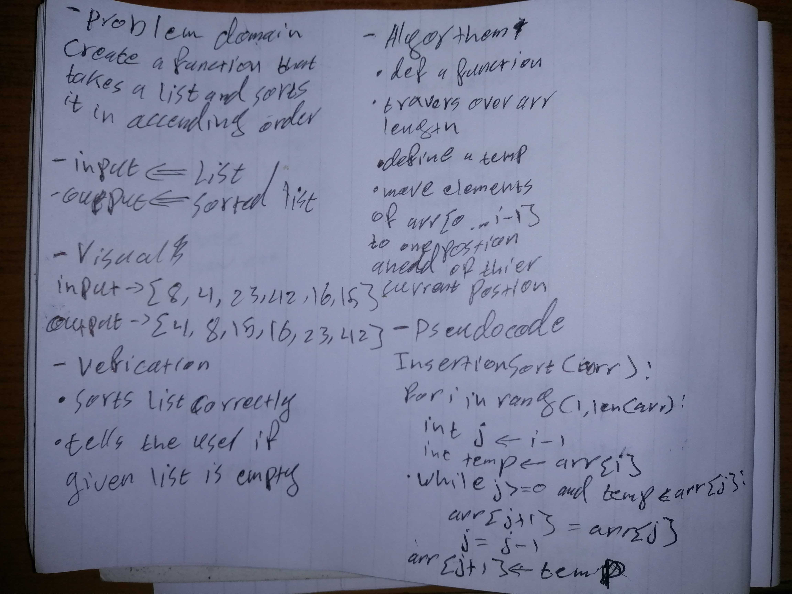

# Challenge Summary
Create a function that takes in a list and returns it sorted in ascending order

## Approach & Efficiency
compared the list 2 elements at a time going through it all

BigO
Time: O(n^2)
Space: O(1)
## Solution

