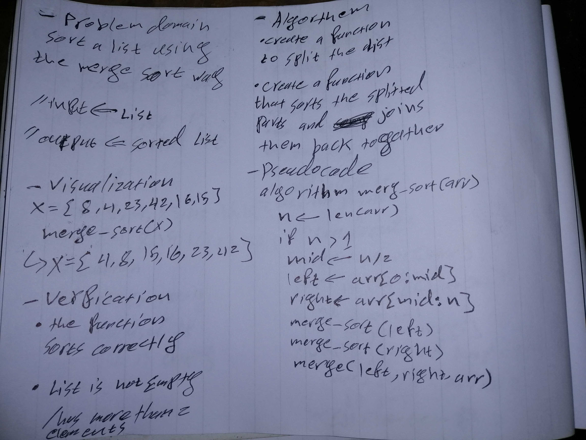

# Challenge Summary
Create a function that takes in a list and returns it sorted in ascending order following the merge sort method

## Approach & Efficiency
went for divide and conquer
BigO
Time: O(n^2)
Space: O(1)
## Solution

