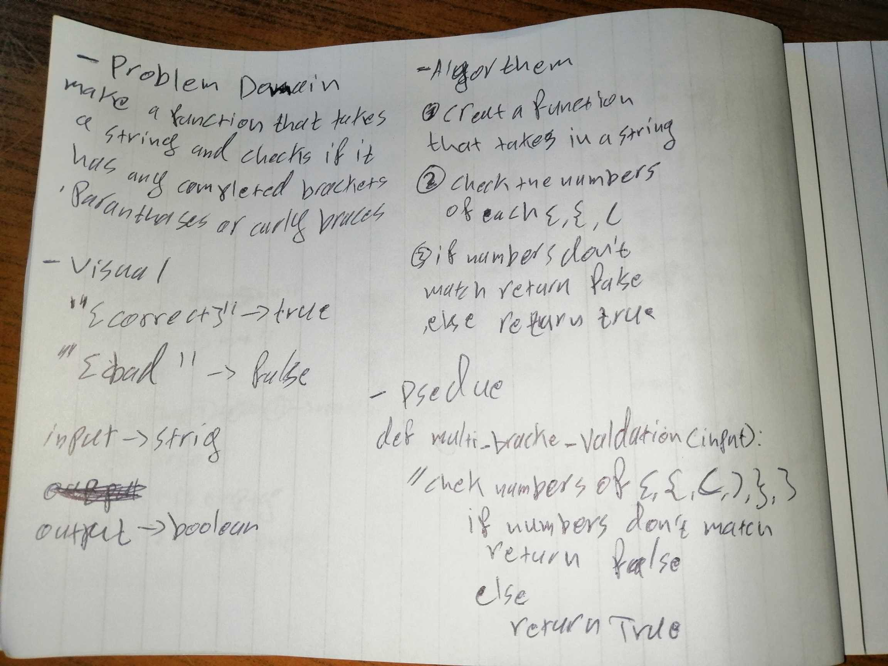

# Validate if brackets are complete
check if brackets are completed correctly in a string

## Challenge
create a function that takes in a string and checks if the brackets inside it ([],(),{}) are completed
return true if they are compelted correctly and false if not
## Approach & Efficiency
i used count for this challnge
i count how many time each bracket occurs and if the counted of the opening bracket is equal to the closing one return true else return false
not sure of the BigO of this one
## Solution

> the code was updated from the code challenge review

