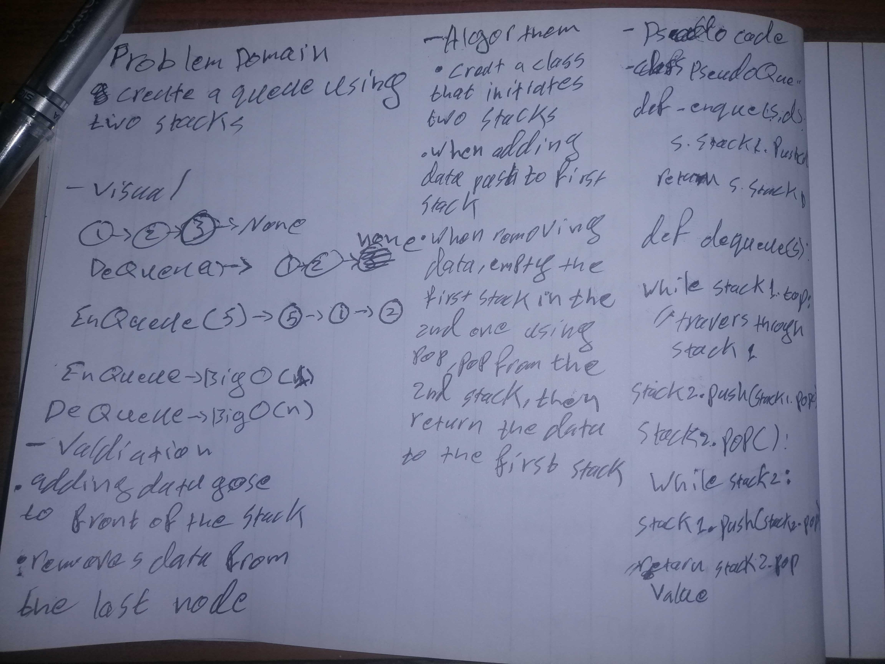

# PseudoQueue
create a queue using a stack
## Challenge
create a fully functioning queue using 2 stacks
## Approach & Efficiency
used 2 stacks
first stack is to enqueue the values (names en ) it shuld be working at O(1)
the 2nd stack is to take the en stack (pop the values of the en stack into the de stack ) and after taking the value we want pop them back in the en stack
so its O(n)
## Solution

