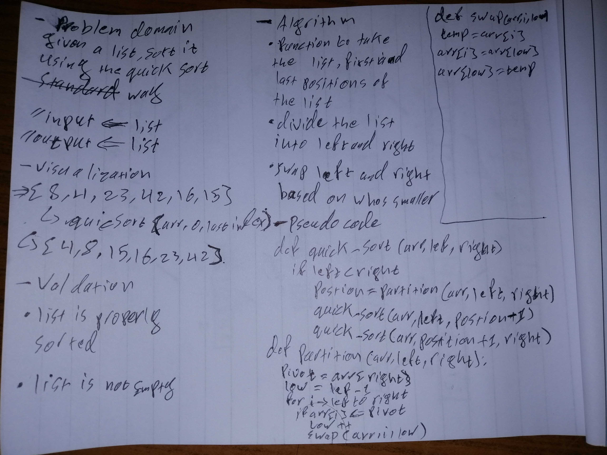

# Challenge Summary
Create a function that takes in a list and returns it sorted in ascending order following the quick sort method

## Approach & Efficiency
went for divide and conquer using a pivot to order the list to its left and right and kept dividing the list until each element is on its own or in the right place
## Solution

