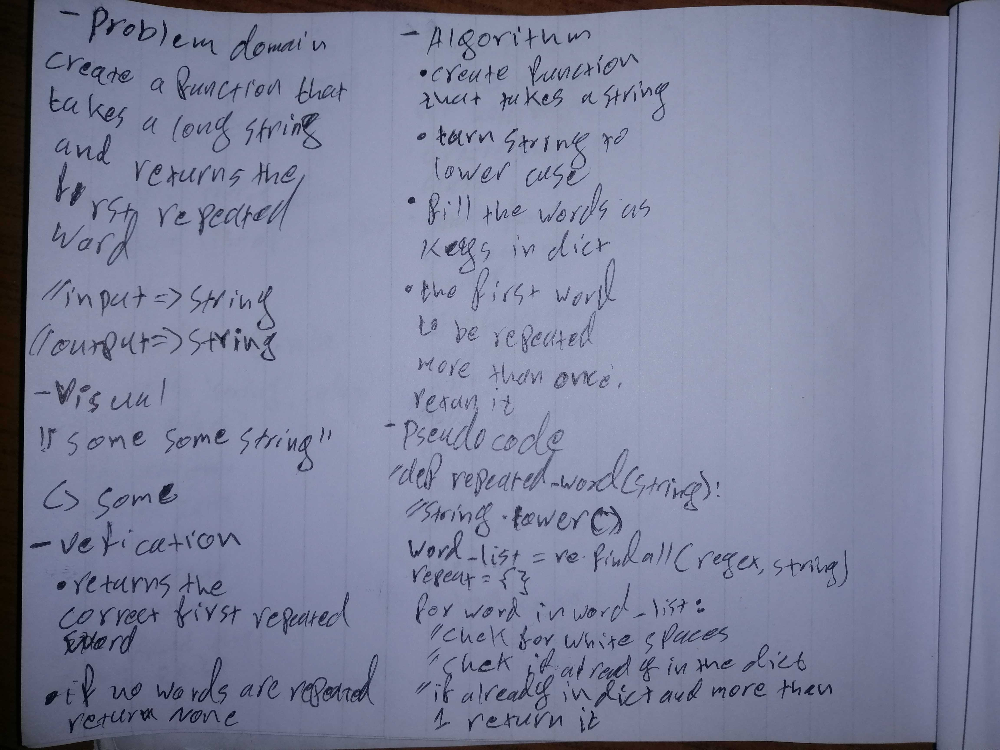

# Challenge Summary
Write a function that accepts a lengthy string parameter.
Without utilizing any of the built-in library methods available to your language, return the first word to occur more than once in that provided string.

## Approach & Efficiency
created a function that takes a sentence
splits the sentence on commas and spaces
and counted repetition for every word

## Solution

