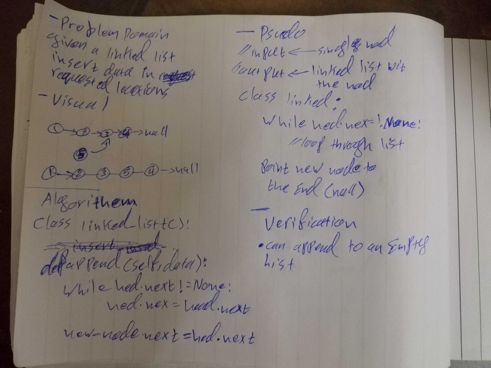

# Singly Linked List
A linked list is a linear data structure, it is a group of nodes liked to each other using pointers
the first node is called the head and the last node is called the tail
the tail points at null (nothing) because there is not value after it

## Challenge
The challenge was to create two classes one for node and one for linked list
the linked list class should have funtions that allow us to:
* insert new element inside the list
* check if an element exists or not
* print the content of the list in a formated way

## Approach & Efficiency
I dont know if the approach i used has a name, i did a 1 by 1 approach
creatd the class and built up the functions one at a time testing if said function works properly or not
Efficiency:
* access an element --> O(n)
* Add/remove at a given index -->O(1)
* Add/remove the first element -->O(1)
* Add lst element --O(1)
* Reemove last element --> O(n)
hopfully i got the efficiency part right (please correct me if am wrong)
## API
My linked list have the following methods :
* Display: returns a list containg the elements of the array
* insert : adds an element to the list
* length : returns the length of the list as an intger
* includes : checks if an element exists in the list and returns a boolean (True/Flase)
* get : returns the value of an element at a given index
* erase : removes an element at a given index

## Whiteboard

