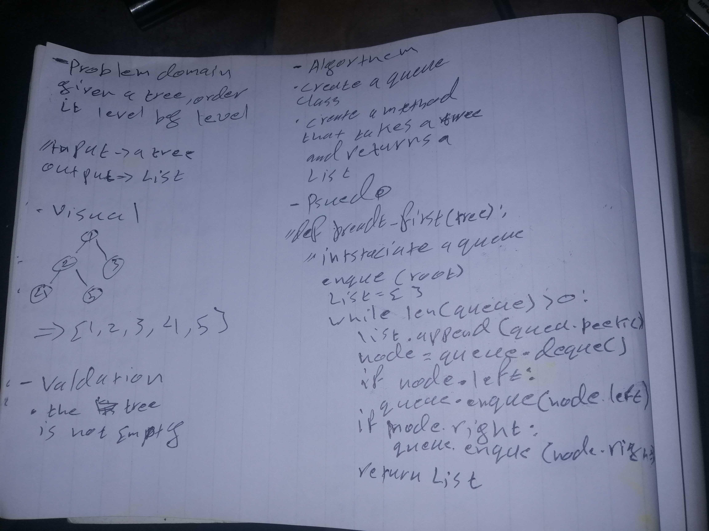

# Trees
A tree data structure can be defined recursively as a collection of nodes (starting at a root node), where each node is a data structure consisting of a value, together with a list of references to nodes (the "children"), with the constraints that no reference is duplicated, and none points to the root.
## Challenge
create a tree class that creates nodes correctly with left and right children
create a binary search tree that can add new values in a correct order  and check for a value if it exists in the tree or not
## Approach & Efficiency
i used recursive approach
binary tree effecnty:
Space		O(n)	O(n)
Search		O(log n)	O(log n)
Insert		O(log n)	O(log n)
## API
### BinaryTree calss:
* print_tree(): pass in a traversal type for it to print the tree in that traversal order (preorder,inorder,postorder)
* pre_order: prints the content of the binary tree in preordered fashion (Root->Left->Right)
* in_order:print the content of the binary tree in inordered fashion (Left->Root->Right)
* post_order: prints the content of the binary tree in post order fashion (Left->Right->Root)
* find_maximum_value: returns the max value in the tree
### BinarySearchTree class:
* add(): adds a new node to the binary tree in the correct postion

* contains(): checks if a value is in the tree and returns true of false based on that (true if the value is there and false if its not)

## Solutions:

